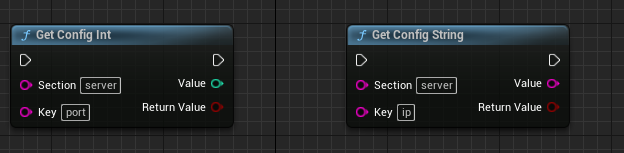
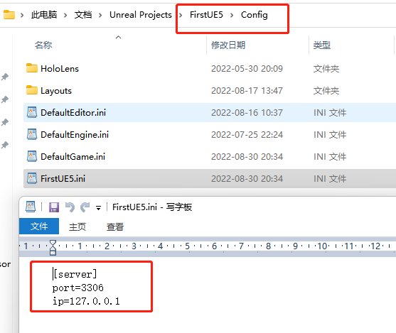
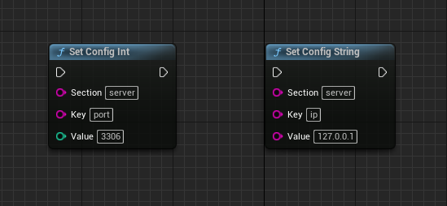

# InConfig
本插件旨在简化配置文件的读写。通过本插件进行读写配置文件，可以适用于编辑器和运行时模型。  

# 使用方法
## 设置配置文件
目前支持字符串和整数的配置文件读写。通过调用蓝图方式，可以实现自动生成配置文件，并且生成的配置文件在打包的时候，会自动被拷贝到安装程序中。  
  
生成的配置文件如下：  
  

## 读取配置文件
目前仅仅支持字符串和整数的配置文件读写。  
  
